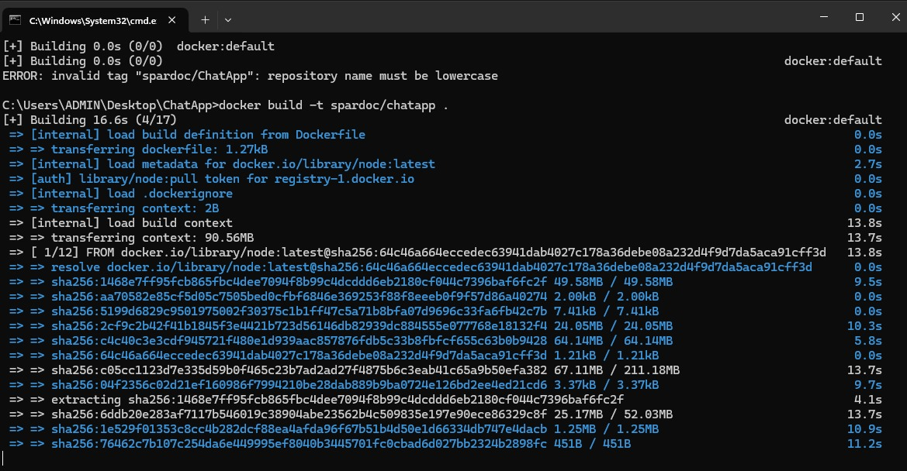
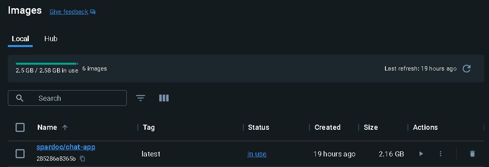
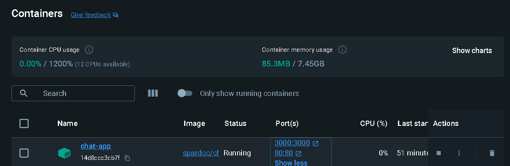
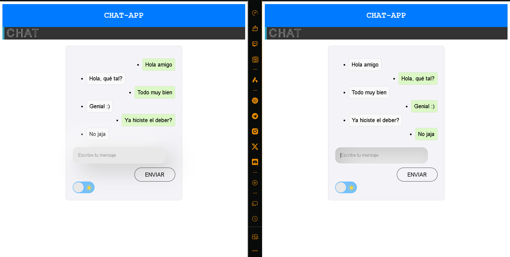

Esta imagen de Docker contiene una aplicación de chat en tiempo real desarrollada con Angular en el frontend y Node.js en el backend. Utiliza WebSockets a través de Socket.IO para permitir una comunicación fluida y en tiempo real entre los usuarios. Es ideal para quienes necesitan implementar una solución de chat básica con tecnologías modernas y contenedorizadas.

Cómo construir la imagen:

Para construir la imagen de Docker para esta aplicación de chat, navegue al directorio donde se encuentra el Dockerfile y ejecute el siguiente comando en la terminal:

```bash 
docker build -t nombre-de-tu-imagen ."
```


Reemplace nombre-de-tu-imagen con el nombre que desea asignar a la imagen de Docker.

Cómo ejecutar la aplicación:

Una vez construida la imagen, puede ejecutar la aplicación utilizando el siguiente comando:

```bash 
docker run -d -p 3000:3000 -p 80:80 --name nombre-del-contenedor nombre-de-tu-imagen
```

Reemplace nombre-del-contenedor con el nombre que desea asignar al contenedor y nombre-de-tu-imagen con el nombre de la imagen que construyó previamente. Este comando inicia el contenedor en modo 'detached', mapea los puertos necesarios para acceder al servidor Node.js y al frontend Angular, y ejecuta ambos servicios dentro del contenedor.

Cómo acceder y probar la funcionalidad del Chat:

Para acceder a la interfaz de la aplicación de chat, abra un navegador web y visite http://localhost:80. Esto le llevará directamente a la interfaz de usuario de la aplicación de chat. Para probar la funcionalidad del chat: Abra varias pestañas o ventanas del navegador en http://localhost:80 para simular múltiples usuarios. En cada pestaña o ventana, escriba mensajes en el cuadro de texto y envíelos. Observe que los mensajes enviados desde una pestaña aparecen en tiempo real en todas las otras pestañas abiertas. Esto confirma que la comunicación en tiempo real está funcionando a través de WebSockets."

Funcionamiento



